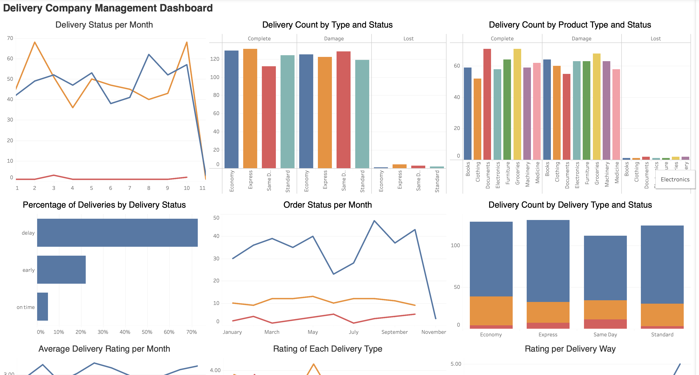

# Delivery Company Analysis

### Dataset Explanation

- `delivery_id` : Unique synthetic identifier for each delivery.
- `delivery_time_start` : Date and time when the delivery process started.
- `delivery_time_finish` : Date and time when the delivery process finished.
- `delivery_time_estimation_in_hours` : Estimated delivery duration in hours before shipment.
- `delivery_time_result_in_hours` : Actual delivery duration in hours.
- `delivery_status` : Delivery outcome (e.g., Complete or Damage).
- `price` : Shipping fee charged for the delivery.
- `weight` : Weight of the shipment in kilograms (kg).
- `product_type` : General category of the shipped product.
- `place_start` : Fictional origin location of the shipment.
- `place_end` : Fictional destination location of the shipment.
- `rating` : Customer satisfaction rating for the delivery service (1–5).
- `delivery_type` : Shipping service level (e.g., Standard, Express, Same Day, Economy).
- `distance` : Shipping distance traveled, in kilometers.
- `delivery_way` : Transportation method used (e.g., Road, Sea, Air, Mixed Way).
- `refund` : Indicates whether the shipment resulted in a refund (Yes or No).
- `carrier_id` : Synthetic identifier for the carrier or driver handling the shipment.
- `package_volume_m3` : Estimated package volume in cubic meters.
---

## Metrics

The dashboard and the analysis focusing on help the Head of Delivery Operation and Head of Inventory at the shipping/delivery company to review their perfomance for the past few months.

- orders delivered on time,
- orders complete,
- order damaged,
- delivery day

[See the dashboard](https://public.tableau.com/views/delivery_17833194809940/Dashboard2?:language=en-GB&:sid=&:redirect=auth&:display_count=n&:origin=viz_share_link)

---

## Insights

### Delivery Status
- According to the data, there are 496 complete delivery, 494 damage delivery, 10 lost delivery
- According to the data, all delivery types have a similar number of damaged deliveries (around 119–128 deliveries) and lost deliveries (ranging from 1–4 deliveries).
- According to the data, Rail has the smallest number of completed and damaged deliveries compared to the other delivery methods.
- For damaged deliveries, Air, Mixed Way, Road, and Sea have a similar number of deliveries.
- Lastly, For lost deliveries, Mixed Way has the highest number.
- According to the data, all product types that have sent thorugh our delivery compnay have a similar number of damaged and lost deliveries

### Product Type
- According to the data, Groceries is the most commonly delivered product type, while Clothing is the least commonly delivered product type.

### Delivery Time
- the average delivery delay is around 8 hours.
- the average early delivery is around 3 hours.
- there are 361 number delay deliveries, 110 early deliveries, 25 on time deliveries
- all product type have similiar number of delay delivery
- Rail has the smallest number of delayed deliveries compared to Air, Mixed Way, Road, and Sea.
- For early deliveries, Air, Mixed Way, Road, and Sea have a similar number of deliveries.
- For on-time deliveries, Mixed Way has the highest number compared to Air, Road, and Sea.
- Economy, Same Day, and Standard delivery types have the highest number of delayed deliveries (90–99 delayed deliveries).
- Express and Same Day delivery types have the highest number of on-time deliveries.
- For early deliveries, the Economy delivery type has the highest number of early deliveries.
- all destination locations have a similar number of delayed and on-time deliveries.

### Rating
- According to the data, all delivery type have a similar average of rating
- Sending medicine using Economy delivery has the lowest rating compared to the other product types.
- For Express and Same Day delivery, sending machinery has the lowest rating compared to the other product types.
- For Standard delivery, sending electronics, documents, groceries, and medicine has the lowest rating.

---
## Recommendations
### Delivery Status
- Conduct extensive research on every order's path from the pickup location to the destination. Build a team at every stage of the delivery process to identify which part of the journey causes products to be damaged or lost. Based on the findings, conduct an evaluation with the delivery and operational teams to solve or improve the delivery journey
- Examine rail delivery way, to understand the cause of minimum damaged deliveries compare to other type of delivery. Accumulate the insight and try to implement the insight to other delivery method to reduce the number of damaged delivery

### Product Type
- Understand why groceries are the most preferred product type for delivery. Gather the insights and identify which aspects can be implemented for other product types.
- Check the causes of the decline in other product deliveries by examining the delivery journey and marketing efforts, or conduct large-scale surveys or interviews with target customers to understand the root cause of the decline.

### Delivery Time
- Examine every delivery that arrive early or on-time with operational, inventory, and delivery team. Check whether if there’s any pattern or insight that could improve our delivery time
- Perform thorough research to each delivery product that we offer to customer, starting from understanding customer experience to conducting examination on every stage of delivery

### Customer Rating
- Conduct a survey or interview to our customer, understand their experience, pain point, and understand thier concern. Basen on the insight, arrange a meeting with the delivery, operational, and inventory team to develop an improved system that meet the customer need.

---
## Acknowledgements

- **Data**: Personal Knowledge and ChatGPT
- **Tools Used:** Jupyter Notebook, SQLite, Tableau

